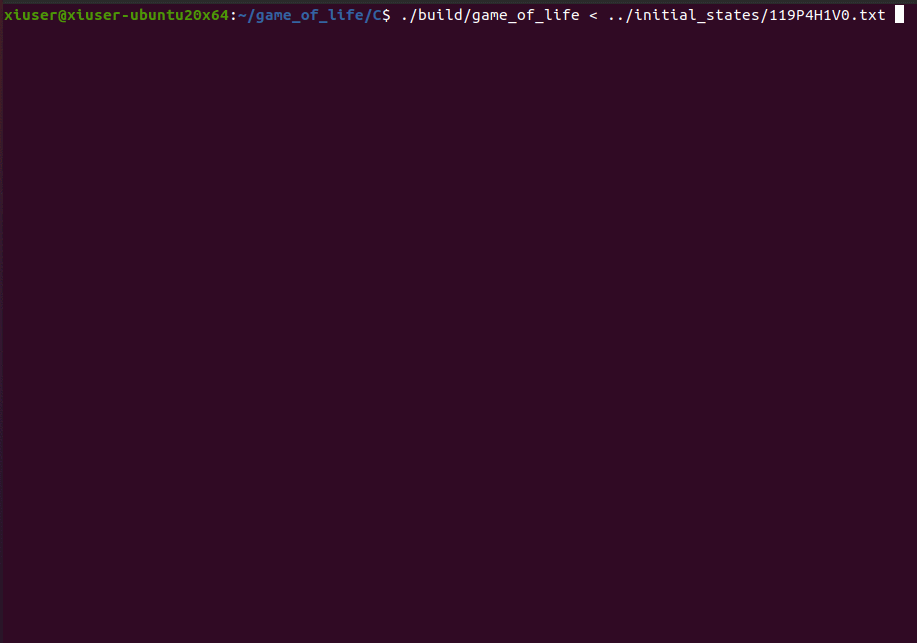
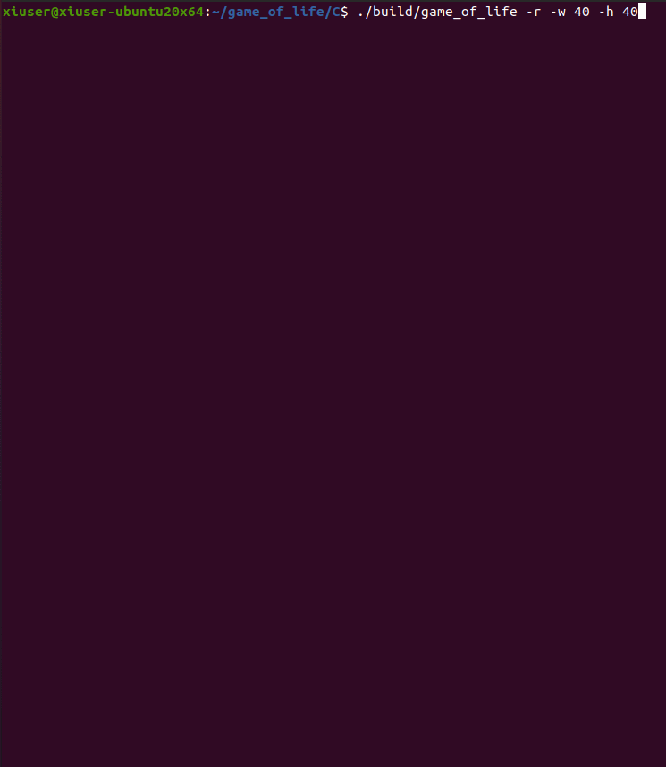

# game_of_life на C
## Сборка в Linux
Для сборки проекта в Linux потребуется установить библиотеку **ncurses** и другие утилиты:

```bash
sudo apt-get update
sudo apt-get install build-essential make libncurses5-dev libncursesw5-dev
```

Чтобы собрать игру, в терминале перейдите в папку **C** и введите:

```bash
make
```
## Запуск в Linux
Чтобы запустить игру, в терминале перейдите в папку **C** и введите команду:
```bash
./build/game_of_life < ../initial_states/<file_name>.txt
```
Вам нужно указать имя файла с начальным состоянием вместо `<file_name>`.

Также вы можете запустить игру со случайным начальным состоянием игрового поля. Для этого выполните команду:

```bash
./build/game_of_life --random [--height HEIGHT --width WIDTH]
```

Здесь значения `HEIGHT` и `WIDTH` - это желаемые высота и ширина игрового поля. Данные аргументы опциональны.

## Примеры запуска

##### Запуск игры с заданным исходным состоянием



##### Запуск игры со случайным исходным состоянием



## Примечание

Работа проверялась на *Ubuntu 18* и *20*.
